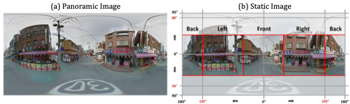
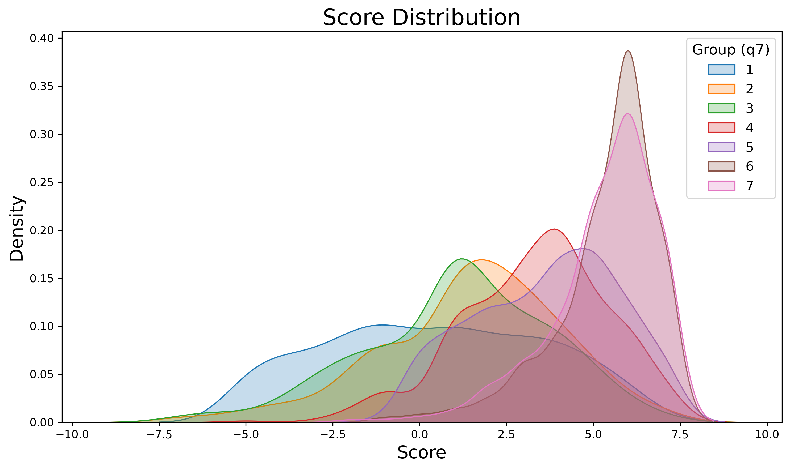
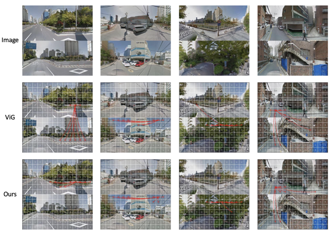

# Supplementary Materials

---

## A. Dataset

### A.1 Demographic Distribution of Survey Participants

**Age**

| | Number | % |
|---|---:|---:|
| 20s | 189 | 7.53 |
| 30s | 656 | 26.14 |
| 40s | 766 | 30.52 |
| 50s | 676 | 26.93 |
| 60s+ | 223 | 8.88 |
| **Total** | **2,510** | **100.00** |

**Length of Residence (years)**

| | Number | % |
|---|---:|---:|
| 0–5 | 690 | 27.49 |
| 5–10 | 605 | 24.10 |
| 10–15 | 476 | 18.96 |
| 15–20 | 269 | 10.72 |
| 20–25 | 202 | 8.05 |
| 25+ | 268 | 10.68 |
| **Total** | **2,510** | **100.00** |

*Table S.1: Demographic distribution by age and years of residence*

---

### A.2 Dataset Statistics

| Label  | 1   | 2   | 3   | 4   | Total |
|--------|-----|-----|-----|-----|-------|
| Images | 815 | 934 | 954 | 707 | 3410  |

*Table S.2: Class Distribution of the Final Dataset*

---

### A.3 GSV Image Preprocessing

  

*Figure S.1: Comparison of panoramic image and static image*

---

### A.4 Spatial Distribution of GSV Points

Figure S.2 illustrates the spatial distribution of GSV points along roads and sidewalks. Orange lines represent sidewalks for pedestrians, while grey lines denote the vehicular roads where GSV imagery was originally captured.

  

*Figure S.2: Spatial distribution of GSV points*

---

### A.5 Urban Expert Annotation

Figure S.4(a) shows a case where an area receives a high walkability score, while the corresponding GSV image does not visually convey that level of walkability. Conversely, Figure S.4(b) shows the opposite case — an area with a low walkability survey score whose GSV image appears highly walkable.

Following prior works highlighting that pedestrian experience depends on micro-scale attributes (e.g., sidewalk presence, maintenance, street aesthetics), each image was evaluated along two main criteria:

- **Negative visual elements**: presence of damaged or unpaved roads, visible cracks or aesthetically disruptive features such as trash, which correspond to lower walkability.
- **Positive visual elements**: presence of greenery, well-maintained sidewalks, and aesthetically appealing facades or streets, which indicate higher walkability.

  

*Figure S.3: KDE plot of Feature Score Distribution*

  

*Figure S.4: Example of mismatch between survey-perceived walkability score and expert annotation*

#### (a) Urban Expert Annotation Guideline

| Features | Negative Elements | Positive Elements |
|---|:---:|:---:|
| Pavement | −1 | +1 |
| Road crack | −1 | — |
| Trash | −1 | — |
| Curbs | −1 | +1 |
| Parking | −1 (e.g., illegal parking) | +1 (e.g., well parked) |
| Road marking | −1 (e.g., faded marking) | +1 |
| Greenery | −1 (e.g., withering greenery) | +1 |
| Building facades | −1 (e.g., cracked, graffiti) | +1 |
| Sidewalk | −1 (e.g., no sidewalk) | +1 |
| Pole | −1 (e.g., messy cables) | — |

#### (b) Urban Expert-Annotated Walkability Score by Feature Score Range

| Walkability Score | Feature Score Range |
|:---:|---|
| 1 | $-10 \leq \text{score} < -6$ |
| 2 | $-6 \leq \text{score} < -3$ |
| 3 | $-3 \leq \text{score} < -1$ |
| 4 | $-1 \leq \text{score} < 1$ |
| 5 | $1 \leq \text{score} < 3$ |
| 6 | $3 \leq \text{score} < 5$ |
| 7 | $5 \leq \text{score} < 7$ |

*Table S.3: Urban Expert Annotation Guideline and Scoring Criteria*

---

## B. Additional Analysis of Graph Construction Mechanism

Figure S.5 shows additional comparisons of edge connections between ViG and our method.

  

*Figure S.5: Visualization of edge connections in ViG and our method*

---

## C. Example of New Cities Dataset

  

  <em>Figure S.6: Examples from the new-city evaluation dataset.</em>

